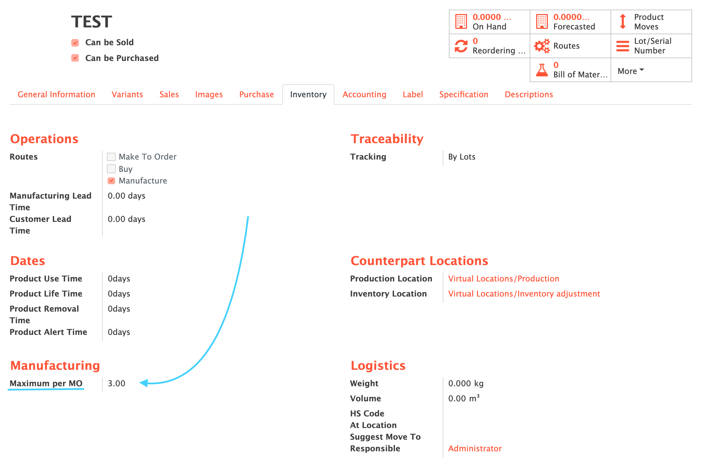
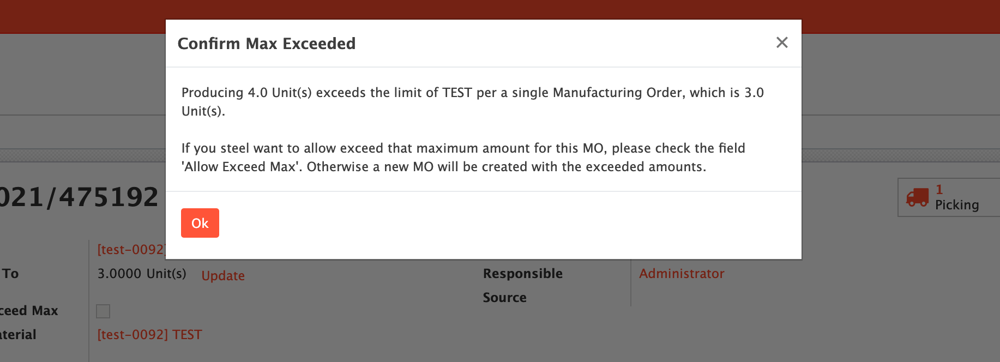

    <a href="https://www.odoo.com/documentation/12.0/index.html">
        </img>
    </a>
    <a href="http://www.alliantum.com">
        </img>
    </a>
    <a href="http://www.gnu.org/licenses/agpl-3.0-standalone.html">
        </img>
    </a>
    <a href="https://github.com/{user_name}/{repo_name}/releases/latest">
        </img>
    </a>

    
    

        <h1>MO Max. Amount</h1>
        Sets a maximum quantity for each product that can be manufactured on single Manufacturing Order.
        

    

## Installation

This module depends on `mrp_production_grouped_by_product`. You can find it at [OCA/mrp_production_grouped_by_product](https://github.com/OCA/manufacture/tree/12.0/mrp_production_grouped_by_product)

- This will be the new field in the product view (both product and variants)
    

        
    

## Usage

Install this add-on and it will be automatically ready to use.
In order to trigger the blocking warning functionality you only need to create a Manufacture Order with more units than what is in the "Maximum per MO" field on the product
    

        
    

## Contributors

- [Alliantum](http://www.alliantum.com)
